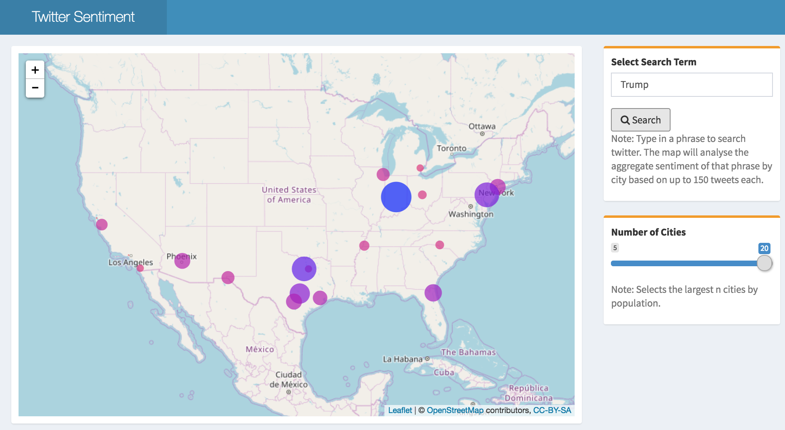
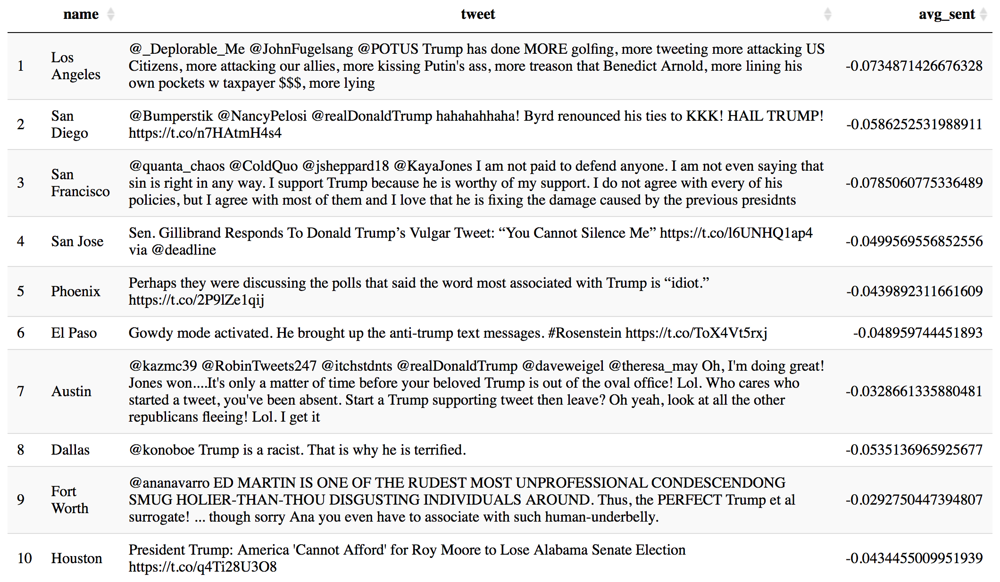

## Twitter Sentiment Analysis Map

This shiny application acts as an exploration of the `sf` package, interactive mapping, and text analysis. This application was created as a project for *GIS Applications: 4280*. Below is the write up that was submitted. 

### Introduction

The advent of social media has enabled social discourse to transcend physical interactions. As a globalizing society, we experience and partake in discourse online. Our fervent Facebook posts and our biting quips on Twitter provide a snapshot into spatiotemporal variation of human emotion and response. I have come to view social media as the largest corpus of data on human behavior and interaction. I seek to explore, uncover, and interpret sentiment, be it about public policy, sport, television, or what have you. 

Following, I shall describe an exploration that has become a bite size application that explores the sentiment of Twitter users in the largest cities in the united states. The application enables the user to enter a search phrase, select a number of cities, and visualize the aggregate sentiment of tweets about the entered phrase in the presented cities. 

### Data

This project is quite unusual compared to those that I have done in the past. There is only one static piece of data utilized, a shapefile of US cities. The other key component to the project is the accessing of Tweets which will be later described in the methodology.

The US cities shapefile used was first downloaded from ESRI’s ArcGIS online USA Major Cities group layer (ESRI, U.S. Census Bureau). The layer displays “the locations of cities within the United States with populations of approximately 10,000 or greater, all state capitals, and the national capital,” (ESRI). This file was then imported into ArcMap and then converted into a shapefile to be used within R (statistical computing language). 

### Sentiment Analysis

The sentiment analysis method of the sentimentr package is “designed to quickly calculate text polarity sentiment at the sentence level” (Rinker 2017). The functions assess polarity of individual words and the combination of valence shifters. Valence shifters can be thought of words that negate, amplify, deamplify, or act adversely to a word that it is paired with. The model’s dictionary lookup, and assessment of these words provide sentence level polarity.

### Methodology

Here, I will provide a general overview of the process I underwent to gather, analyze, and visualize Tweets in (semi) real time. 

The application provides a sliding bar that allows the user to select a number of cities to visualize ranging from five to twenty cities. The cities utilized were chosen by filtering the top n, where n is the number chosen on the slider, based on population. Large cities were used to prevent a dearth of tweets. The cities that can be potentially queries, in no particular order, are: Los Angeles, San Diego, San Francisco, San Jose, Phoenix, El Paso, Austin, Dallas, Fort Worth, Houston, San Antonio, Jacksonville, Chicago, Memphis, Indianapolis, Charlotte, Columbus, New York, Philadelphia, and Detroit. The chosen cities were then used to query the Twitter application programming interface (API). Each city is queried for the provided search term within a ten mile radius of the coordinates of the city. Each city is only queried for up to 150 tweets. This number was chosen to accommodate the limitations of the Twitter API. The API restricts the number of possible tweets to be extracted to 18,000 every fifteen minutes. In an attempt to obtain a large enough sample and not quickly exceed the limitations of the API, 150 tweets was chosen. 

Each tweet was then analyzed for sentence level average sentiment using the sentimentr package (Rinker 2017). The analysis of sentiment for each tweet is done using the out of the box methodology that sentimentr provides. Tweets, along with their polarity score were joined and aggregated to their respective cities. The average scores were then rescaled to be between 0-1 due to limitations of the leaflet package for displaying continuous data. 

 
### Results

The nature of this project does not allow for static results. But rather, it is intended to enable temporal understanding of sentiment across the United States for any given search term. Additionally, the program is intended to act as a dashboard to be utilized for quick visualizations and high level analysis. I will provide an example of the output for the search term “Trump” for the twenty largest cities in the united states.  Moreover, I will attempt to illustrate what occurs in the backend. 

Below is a visualization of the average sentiment of the phrase “Trump” searched on twitter for the largest 20 cities in the United States. The size of the circle represents the absolute value of sentiment. And the color of the dot is the value of that sentiment. One can click on each dot to obtain a popup of the city name and the assigned score.

The figure below displays a sample of 10 tweets extracted containing the phrase “Trump”. Of the 3952 tweets that were gathered at the time of this query, sentiment scores ranged from a low of   -1.488 to a high of 0.91. However, when aggregated, it is discovered that not even one of the 20 largest cities in the US has a positive sentiment regarding the phrase “Trump”. 

### Conclusion

The development of interactive and open source geospatial research requires knowledge of not only GIS methods, but about the underlying aspects of each tool used, user design, and experience. This research project was a first foray into developing geospatial products using the open source statistical programming language R. 

The nature of these tools seem to be anarchic and unruly. However, these tools are open to public scrutiny and enable reproducible content. This project runs using two R scripts that are currently publicly available on Github (https://github.com/JosiahParry/twitter_sentiment_map). Unlike with standard ESRI products, analyses can be followed through logically with a single reading of the script (assuming one understands the language). I believe this is where the strength of the project lays. 

In order to further this project I would firstly address the glaringly obvious cartographic issues, legend, scale bar, north arrow, etc. Secondly, I would expand on the application in such a way that it would provide better output. These outputs would include a table of top tweets and their contribution to sentiment polarity, among others. And as a final step, I would alter this application so that it could read and analyze tweets in real time. 

--------

## Poster

-------- 

## References

Kearney, M. W. (2017). rtweet: Collecting Twitter Data. R package version 0.6.0 Retrieved
  from https://cran.r-project.org/package=rtweet

Rinker, T. W. (2017). sentimentr: Calculate Text Polarity Sentiment version 1.0.1.
  University at Buffalo. Buffalo, New York. http://github.com/trinker/sentimentr

Stefan Milton Bache and Hadley Wickham (2014). magrittr: A Forward-Pipe Operator for R. R
  package version 1.5. https://CRAN.R-project.org/package=magrittr

Edzer Pebesma (2017). sf: Simple Features for R. R package version 0.5-5.
  https://CRAN.R-project.org/package=sf

Hadley Wickham, Romain Francois, Lionel Henry and Kirill Müller (2017). dplyr: A Grammar
  of Data Manipulation. R package version 0.7.4. https://CRAN.R-project.org/package=dplyr

Joe Cheng, Bhaskar Karambelkar and Yihui Xie (2017). leaflet: Create Interactive Web Maps
  with the JavaScript 'Leaflet' Library. R package version 1.1.0.
  https://CRAN.R-project.org/package=leaflet

Winston Chang, Joe Cheng, JJ Allaire, Yihui Xie and Jonathan McPherson (2017). shiny: Web
  Application Framework for R. R package version 1.0.5.
  https://CRAN.R-project.org/package=shiny

Winston Chang and Barbara Borges Ribeiro (2017). shinydashboard: Create Dashboards with
  Shiny. R package version 0.6.1. https://CRAN.R-project.org/package=shinydashboard

Jeroen Ooms (2017). curl: A Modern and Flexible Web Client for R. R package version
  2.8.1. https://CRAN.R-project.org/package=curl

R Core Team (2017). R: A language and environment for statistical computing. R Foundation
  for Statistical Computing, Vienna, Austria. URL https://www.R-project.org/.
